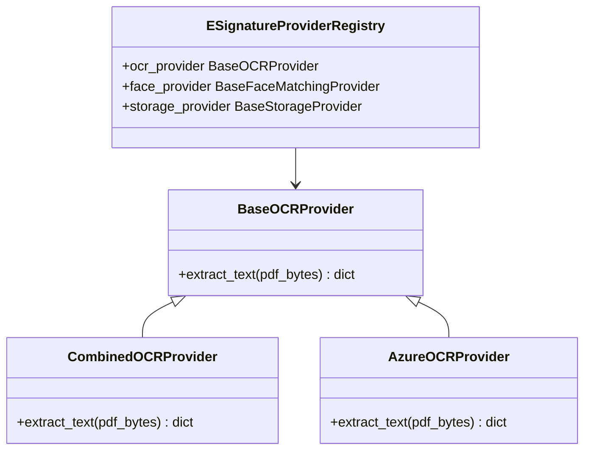

# Provider Registry Documentation

This document describes the pluggable service provider model for the E-Signature platform. External service dependencies (OCR engines, Face Match models, Liveness checks, Storage adapters, Certificate generators, and Notifications) are decoupled from the core workflow engine.

---

## 1. Provider Categories and Architecture

The platform defines abstract base classes for each external dependency. Runtimes resolve active providers using the centralized `esign_provider_registry` configured through Django settings.



---

## 2. Configuration Settings Mapping
To swap providers, configure the corresponding setting in Django settings:

* **OCR Engine**: Set `ESIGN_OCR_PROVIDER = "azure"` (Default: `"paddle"`/`"combined"`).
* **Face Comparison**: Set `ESIGN_FACE_PROVIDER = "insightface"` (Default: `"insightface"`).
* **Liveness Checks**: Set `ESIGN_LIVENESS_PROVIDER = "placeholder"` (Default: `"placeholder"`).
* **Notifications**: Set `ESIGN_NOTIFICATION_PROVIDER = "smtp"` (Default: `"email"`/`"smtp"`).

---

## 3. Provider Extension Guide (Implementing a New Provider)

To introduce a new provider implementation, implement a class that inherits from the abstract base class and register it in `esign/providers/registry.py`.

### Required Interfaces and Contracts

#### 1. OCR Interface (`BaseOCRProvider`)
* **Base Module**: [base.py](file:///c:/Users/Mohammed%20Hamza/esign_Module/esign-backend/esign/providers/base.py)
* **Required Method**: `extract_text(self, pdf_bytes: bytes) -> dict`
* **Expected Response Shape**:
  ```python
  {
      "raw_text": str,
      "english_text": str,
      "arabic_text": str,
      "ocr_provider": str,
      "ocr_confidence": float,  # Range 0.0 - 1.0
      "fallback_used": bool
  }
  ```
* **Error Expectations**: Raise a standard exception (e.g. `ValueError`, `ConnectionError`) on API connectivity issues to allow standard fallback behavior in the core task orchestrator.

#### 2. Face Matching Interface (`BaseFaceMatchingProvider`)
* **Base Module**: [base.py](file:///c:/Users/Mohammed%20Hamza/esign_Module/esign-backend/esign/providers/base.py)
* **Required Method**: `calculate_similarity(self, image1_bytes: bytes, image2_bytes: bytes) -> float`
* **Expected Response Shape**: Return similarity score as a float from `0.0` to `1.0`.

#### 3. Storage Interface (`BaseStorageProvider`)
* **Base Module**: [base.py](file:///c:/Users/Mohammed%20Hamza/esign_Module/esign-backend/esign/providers/base.py)
* **Required Methods**:
  - `save(self, name: str, content: bytes) -> str`: Persist bytes to storage, returning target storage identifier/file path.
  - `exists(self, name: str) -> bool`: Query file existence.

---

## 4. Provider Lifecycle and Resolution
Providers are lazily initialized on the first call to `esign_provider_registry.{provider_type}` properties and cached as singletons for the duration of the server process. If an invalid or unconfigured provider name is defined, the system fails-fast on startup with an `ImproperlyConfigured` exception.
